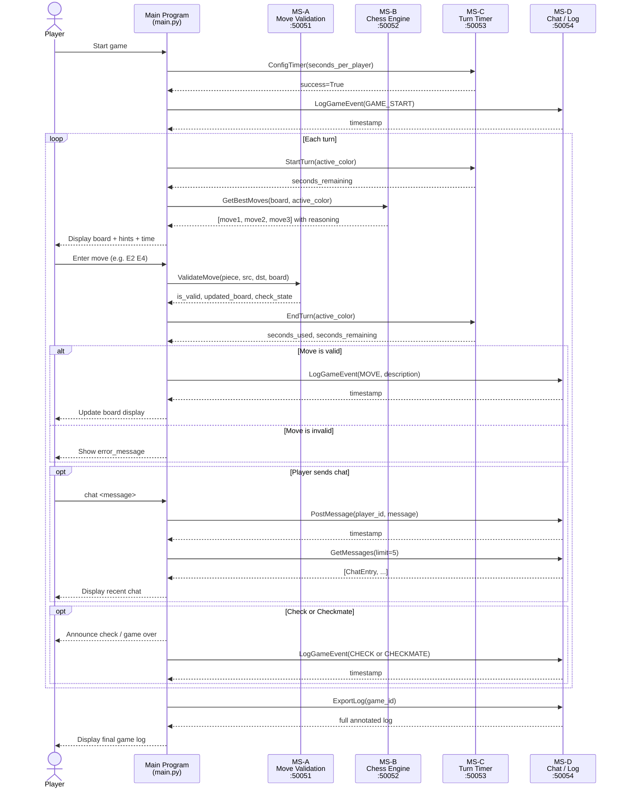

# Chess Trainer
**CS 361 — Final Project**

A terminal-based chess coaching application. Four independent microservices
handle move validation, move suggestions, turn timing, and game chat/logging.
The main program orchestrates them exclusively through gRPC — no microservice
is ever imported directly.

---

## Architecture overview

```
                        ┌─────────────────────┐
                        │    main.py           │
                        │  (main program /     │
                        │   orchestrator)      │
                        └──────────┬──────────┘
          gRPC requests / responses │
     ┌──────────┬──────────────┬───┴────────┐
     ▼          ▼              ▼            ▼
 port 50051  port 50052    port 50053   port 50054
 MS-A        MS-B          MS-C         MS-D
 Move        Chess         Turn         Chat /
 Validation  Engine        Timer        Game Log
```

| Service | File | Port | Responsibility |
|---|---|---|---|
| Microservice A | `services/validation/server.py` | 50051 | Is this move legal? |
| Microservice B | `services/engine/server.py`     | 50052 | Top 3 best moves |
| Microservice C | `services/timer/server.py`      | 50053 | Per-player countdown |
| Microservice D | `services/chat/server.py`       | 50054 | Chat + game log |
| Main program   | `main_app/main.py`              | —     | UI + orchestrator |

---

## Project structure

```
chess_trainer/
├── start_all.py                  ← starts all 5 processes
├── integration_test.py           ← tests all 4 microservices
├── main_app/
│   └── main.py                   ← main program (5th process)
└── services/
    ├── validation/
    │   ├── server.py             ← Microservice A
    │   ├── chess.proto
    │   ├── chess_pb2.py          ← generated stubs (do not edit)
    │   └── chess_pb2_grpc.py
    ├── engine/
    │   ├── server.py             ← Microservice B
    │   ├── engine.proto
    │   ├── engine_pb2.py
    │   └── engine_pb2_grpc.py
    ├── timer/
    │   ├── server.py             ← Microservice C
    │   ├── timer.proto
    │   ├── timer_pb2.py
    │   └── timer_pb2_grpc.py
    └── chat/
        ├── server.py             ← Microservice D
        ├── chat.proto
        ├── chat_pb2.py
        └── chat_pb2_grpc.py
```

---

## Setup

### 1. Install dependencies (one time)

```bash
pip install grpcio grpcio-tools
```

### 2. Regenerate stubs (only needed if you change a .proto file)

```bash
cd services/validation && python3 -m grpc_tools.protoc -I. --python_out=. --grpc_python_out=. chess.proto
cd services/engine     && python3 -m grpc_tools.protoc -I. --python_out=. --grpc_python_out=. engine.proto
cd services/timer      && python3 -m grpc_tools.protoc -I. --python_out=. --grpc_python_out=. timer.proto
cd services/chat       && python3 -m grpc_tools.protoc -I. --python_out=. --grpc_python_out=. chat.proto
```

---

## Running the project

### Option A — All-in-one launcher (recommended for demo)

```bash
python3 start_all.py
```

This opens five separate processes and prints each PID. Press Ctrl+C to stop all.

### Option B — Manual (five separate terminals)

```bash
# Terminal 1 — Microservice A
cd services/validation && python3 server.py

# Terminal 2 — Microservice B
cd services/engine && python3 server.py

# Terminal 3 — Microservice C
cd services/timer && python3 server.py

# Terminal 4 — Microservice D
cd services/chat && python3 server.py

# Terminal 5 — Main program
cd main_app && python3 main.py
```

### Running the integration test

With all four microservices running:

```bash
python3 integration_test.py
```

Expected output: `Results: 24 passed / 0 failed / 24 total`

---

## Game commands

Once inside the game:

| Command | What it does | Microservice called |
|---|---|---|
| `E2 E4` | Attempt a move | MS-A validates, MS-C deducts time, MS-D logs |
| `hint` | Toggle move hints on/off | MS-B on next turn |
| `chat <msg>` | Send a chat message | MS-D stores and displays |
| `log` | Show full annotated game log | MS-D exports |
| `quit` | End the game | MS-D logs game end |

---

## Communication contracts

> ⚠️ These contracts are locked. Do not change field names or types after teammates integrate.

---

### Microservice A — Move Validation (port 50051)

**Requesting data:**

```python
import grpc, json, chess_pb2, chess_pb2_grpc

stub = chess_pb2_grpc.MoveValidatorStub(grpc.insecure_channel("localhost:50051"))

response = stub.ValidateMove(chess_pb2.ValidateMoveRequest(
    game_id         = "game_001",
    player_id       = "player_white",
    piece_position  = "E2",
    target_position = "E4",
    move_type       = "NORMAL",          # NORMAL | CASTLE | PROMOTION | EN_PASSANT
    board_state     = json.dumps(board), # dict {square: "COLOR_PIECE"}
))
```

**Receiving data:**

```python
response.is_valid        # bool   — True if the move is legal
response.check_state     # bool   — True if opponent is now in check
response.checkmate       # bool   — True if opponent is in checkmate
response.updated_board   # str    — JSON board after the move
response.error_message   # str    — reason for rejection (empty if valid)
```

---

### Microservice B — Chess Engine (port 50052)

**Requesting data:**

```python
import grpc, json, engine_pb2, engine_pb2_grpc

stub = engine_pb2_grpc.ChessEngineStub(grpc.insecure_channel("localhost:50052"))

response = stub.GetBestMoves(engine_pb2.BestMovesRequest(
    game_id      = "game_001",
    board_state  = json.dumps(board),  # current board
    active_color = "WHITE",            # "WHITE" or "BLACK"
))
```

**Receiving data:**

```python
for move in response.moves:       # list of up to 3 SuggestedMove objects
    move.rank            # int  — 1 (best), 2, or 3
    move.piece_position  # str  — e.g. "E2"
    move.target_position # str  — e.g. "E4"
    move.move_type       # str  — "NORMAL" etc.
    move.score           # int  — centipawn evaluation score
    move.reasoning       # str  — human-readable explanation

response.error_message   # str  — populated if no moves found
```

---

### Microservice C — Turn Timer (port 50053)

**Requesting data (four RPCs):**

```python
import grpc, timer_pb2, timer_pb2_grpc

stub = timer_pb2_grpc.TurnTimerStub(grpc.insecure_channel("localhost:50053"))

# Configure time bank before the game starts
stub.ConfigTimer(timer_pb2.ConfigTimerRequest(
    game_id=game_id, seconds_per_player=300))

# When a player's turn begins
stub.StartTurn(timer_pb2.StartTurnRequest(
    game_id=game_id, active_color="WHITE"))

# Poll during the turn
response = stub.CheckTime(timer_pb2.CheckTimeRequest(
    game_id=game_id, active_color="WHITE"))

# When a player's turn ends
stub.EndTurn(timer_pb2.EndTurnRequest(
    game_id=game_id, active_color="WHITE"))
```

**Receiving data:**

```python
# CheckTime response
response.seconds_remaining  # int   — seconds left in this player's bank
response.time_expired       # bool  — True if bank reached zero

# EndTurn response
response.seconds_used       # int   — seconds consumed this turn
response.seconds_remaining  # int   — updated bank after deduction
```

---

### Microservice D — Chat / Game Log (port 50054)

**Requesting data:**

```python
import grpc, chat_pb2, chat_pb2_grpc

stub = chat_pb2_grpc.ChatServiceStub(grpc.insecure_channel("localhost:50054"))

# Post a player chat message
stub.PostMessage(chat_pb2.PostMessageRequest(
    game_id="game_001", player_id="WHITE", message="Good move!"))

# Log a game event (called by main program automatically)
stub.LogGameEvent(chat_pb2.LogEventRequest(
    game_id="game_001", event_type="MOVE",
    description="White played E2→E4"))

# Retrieve messages
response = stub.GetMessages(chat_pb2.GetMessagesRequest(
    game_id="game_001", limit=10))  # 0 = all

# Export full annotated log
response = stub.ExportLog(chat_pb2.ExportLogRequest(game_id="game_001"))
```

**Receiving data:**

```python
# GetMessages response
for entry in response.entries:
    entry.timestamp   # str  — "HH:MM:SS"
    entry.player_id   # str  — player name or "SYSTEM"
    entry.message     # str  — message or event description
    entry.entry_type  # str  — "CHAT" or "EVENT"

# ExportLog response
response.full_log       # str  — full plain-text annotated log
response.total_entries  # int  — total number of entries
```

---

## UML Sequence Diagram



---

## Port reference

| Port | Microservice | Proto file |
|------|-------------|------------|
| 50051 | Move Validation | `services/validation/chess.proto` |
| 50052 | Chess Engine    | `services/engine/engine.proto`    |
| 50053 | Turn Timer      | `services/timer/timer.proto`      |
| 50054 | Chat / Game Log | `services/chat/chat.proto`        |
